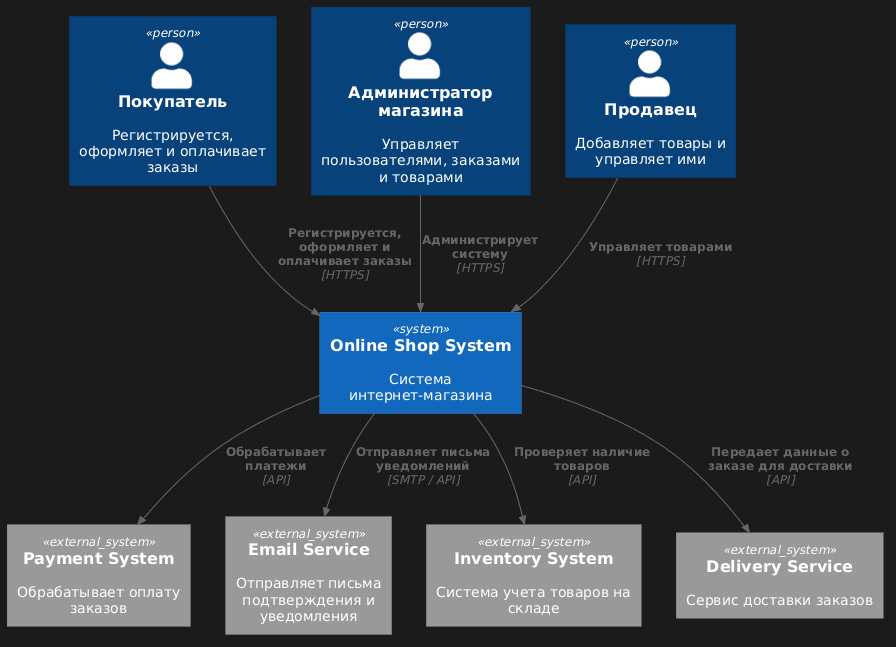
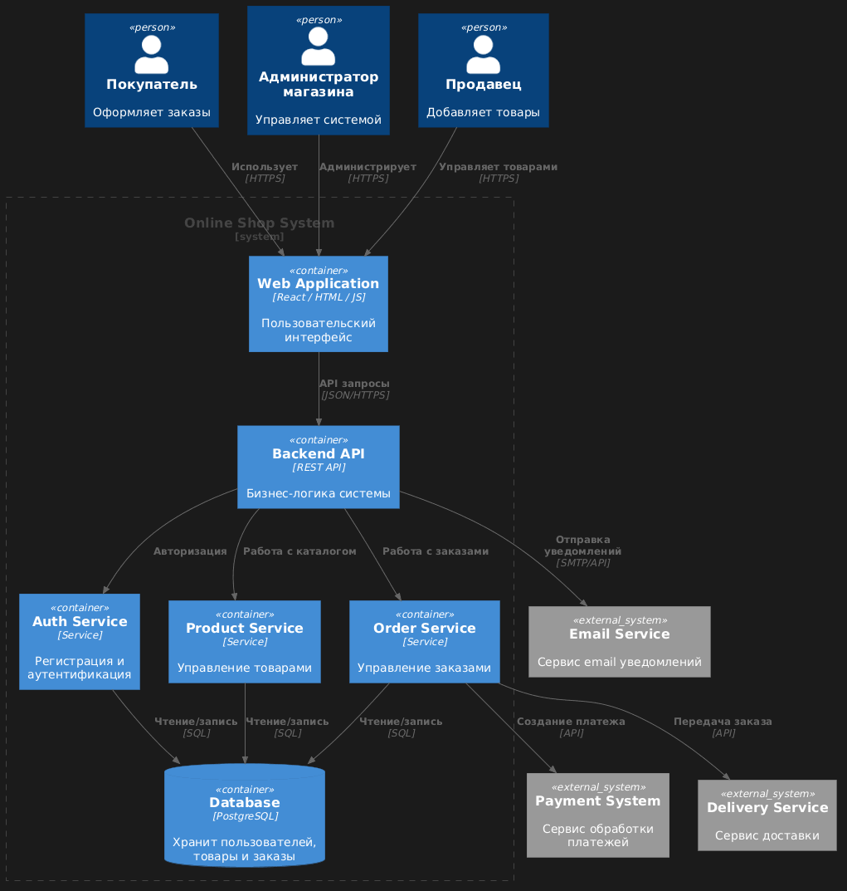

### Lvl 1 (Context)

```
@startuml
!include https://raw.githubusercontent.com/plantuml-stdlib/C4-PlantUML/master/C4_Context.puml

Person(customer, "Покупатель", "Регистрируется, оформляет и оплачивает заказы")
Person(admin, "Администратор магазина", "Управляет пользователями, заказами и товарами")
Person(seller, "Продавец", "Добавляет и управляет товарами")

System(shop_system, "Online Shop System", "Система интернет-магазина")

System_Ext(payment_system, "Payment System", "Обрабатывает оплату заказов")
System_Ext(email_system, "Email Service", "Отправляет письма подтверждения и уведомления")
System_Ext(inventory_system, "Inventory System", "Система учета товаров на складе")
System_Ext(delivery_system, "Delivery Service", "Сервис доставки заказов")

Rel(customer, shop_system, "Регистрируется, оформляет и оплачивает заказы", "HTTPS")
Rel(admin, shop_system, "Администрирует систему", "HTTPS")
Rel(seller, shop_system, "Управляет товарами", "HTTPS")

Rel(shop_system, payment_system, "Обрабатывает платежи", "API")
Rel(shop_system, email_system, "Отправляет письма уведомлений", "SMTP / API")
Rel(shop_system, inventory_system, "Проверяет наличие товаров", "API")
Rel(shop_system, delivery_system, "Передает данные о заказе для доставки", "API")

@enduml
```

### Lvl 2 (Containers)

```
@startuml
!includeurl https://raw.githubusercontent.com/plantuml-stdlib/C4-PlantUML/master/C4_Container.puml

Person(customer, "Покупатель", "Оформляет заказы")
Person(admin, "Администратор магазина", "Управляет системой")
Person(seller, "Продавец", "Добавляет товары")

System_Ext(payment_system, "Payment System", "Сервис обработки платежей")
System_Ext(email_system, "Email Service", "Сервис email уведомлений")
System_Ext(delivery_system, "Delivery Service", "Сервис доставки")

System_Boundary(system, "Online Shop System") {
    Container(web, "Web Application", "React / HTML / JS", "Пользовательский интерфейс")
    Container(api, "Backend API", "REST API", "Бизнес-логика системы")
    Container(auth, "Auth Service", "Service", "Регистрация и аутентификация")
    Container(order, "Order Service", "Service", "Управление заказами")
    Container(product, "Product Service", "Service", "Управление товарами")
    ContainerDb(db, "Database", "PostgreSQL", "Хранит пользователей, товары и заказы")
}

Rel(customer, web, "Использует", "HTTPS")
Rel(admin, web, "Администрирует", "HTTPS")
Rel(seller, web, "Управляет товарами", "HTTPS")

Rel(web, api, "API запросы", "JSON/HTTPS")

Rel(api, auth, "Авторизация")
Rel(api, order, "Работа с заказами")
Rel(api, product, "Работа с каталогом")

Rel(auth, db, "Чтение/запись", "SQL")
Rel(order, db, "Чтение/запись", "SQL")
Rel(product, db, "Чтение/запись", "SQL")

Rel(order, payment_system, "Создание платежа", "API")
Rel(order, delivery_system, "Передача заказа", "API")
Rel(api, email_system, "Отправка уведомлений", "SMTP/API")

@enduml
```

### Lvl 3 (Components)
N/A
### Lvl 4 (Code)
N/A
