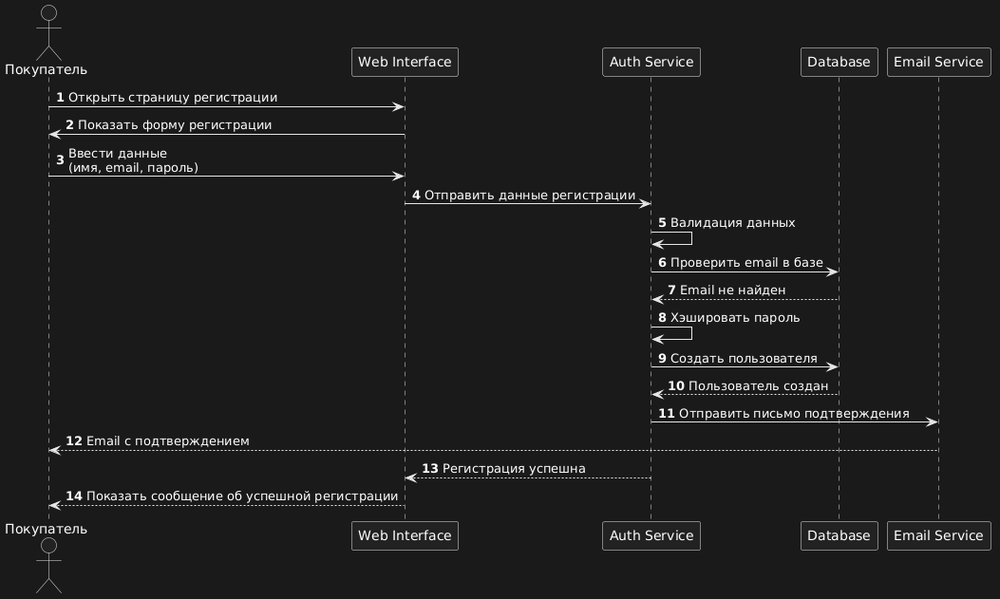
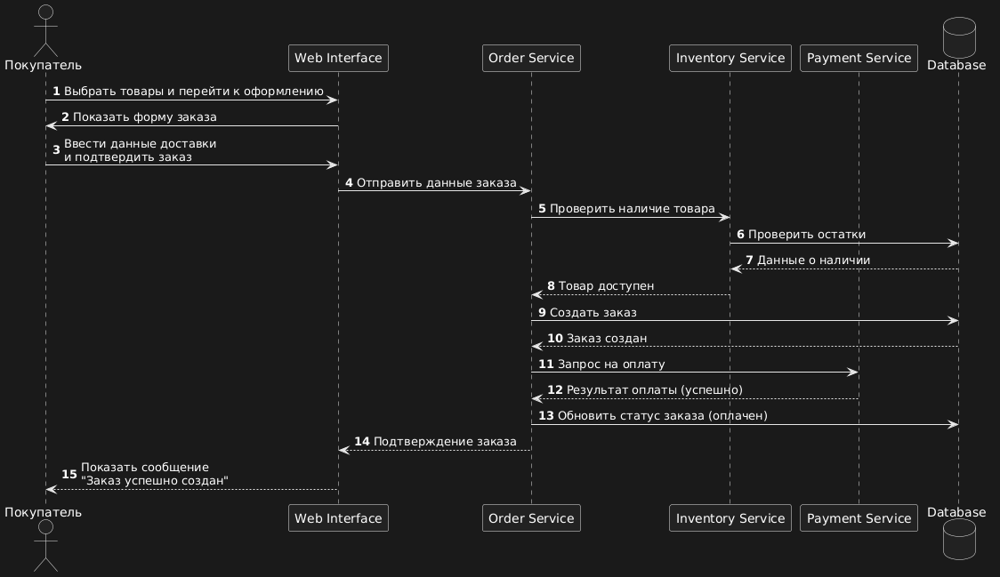
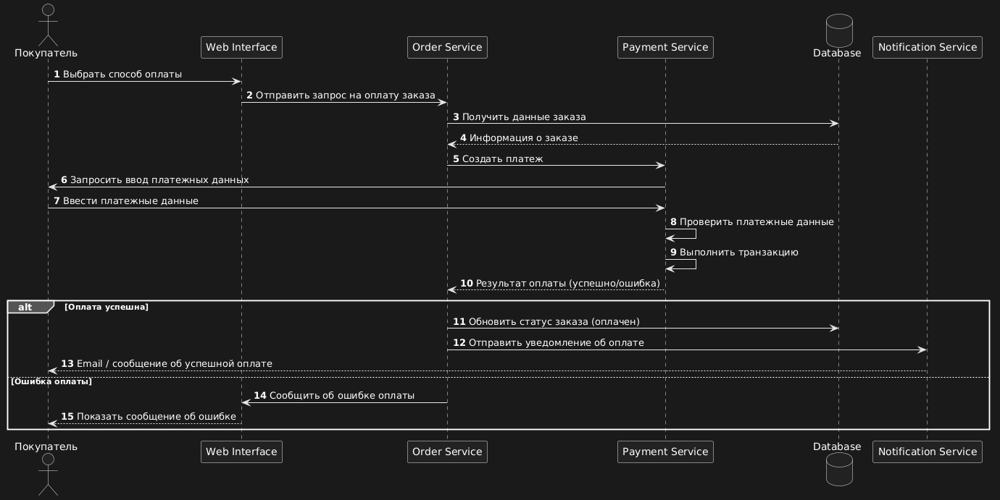

# Описание взаимодействия компонентов системы

### Диаграмма последовательности (Регистрация покупателя)

```
@startuml
autonumber
actor Customer as "Покупатель"
participant "Web Interface" as UI
participant "Auth Service" as Auth
participant "Database" as DB
participant "Email Service" as Email

Customer -> UI : Открыть страницу регистрации
UI -> Customer : Показать форму регистрации

Customer -> UI : Ввести данные\n(имя, email, пароль)

UI -> Auth : Отправить данные регистрации

Auth -> Auth : Валидация данных

Auth -> DB : Проверить email в базе
DB --> Auth : Email не найден

Auth -> Auth : Хэшировать пароль

Auth -> DB : Создать пользователя
DB --> Auth : Пользователь создан

Auth -> Email : Отправить письмо подтверждения
Email --> Customer : Email с подтверждением

Auth --> UI : Регистрация успешна
UI --> Customer : Показать сообщение об успешной регистрации

@enduml
```

| №   | Шаг                                        | Описание                                                                               |
| --- | ------------------------------------------ | -------------------------------------------------------------------------------------- |
| 1   | Открыть страницу регистрации               | Покупатель переходит на страницу регистрации в интернет-магазине.                      |
| 2   | Показать форму регистрации                 | Web Interface отображает форму для ввода регистрационных данных.                       |
| 3   | Ввести данные                              | Покупатель вводит имя, email и пароль для регистрации.                                 |
| 4   | Отправить данные регистрации               | Web Interface отправляет введенные данные в Auth Service.                              |
| 5   | Валидация данных                           | Auth Service проверяет корректность введенных данных.                                  |
| 6   | Проверить email в базе                     | Auth Service отправляет запрос в Database для проверки, существует ли указанный email. |
| 7   | Email не найден                            | Database сообщает, что пользователь с таким email не найден.                           |
| 8   | Хэшировать пароль                          | Auth Service выполняет хэширование пароля для безопасного хранения.                    |
| 9   | Создать пользователя                       | Auth Service отправляет запрос в Database на создание нового пользователя.             |
| 10  | Пользователь создан                        | Database подтверждает успешное создание пользователя.                                  |
| 11  | Отправить письмо подтверждения             | Auth Service отправляет запрос в Email Service для отправки письма подтверждения.      |
| 12  | Email с подтверждением                     | Email Service отправляет пользователю письмо для подтверждения регистрации.            |
| 13  | Регистрация успешна                        | Auth Service сообщает Web Interface об успешной регистрации.                           |
| 14  | Показать сообщение об успешной регистрации | Web Interface отображает пользователю сообщение о завершении регистрации.              |

---
### Диаграмма последовательности (Создание заказа)


```
@startuml
autonumber
actor Customer as "Покупатель"
participant "Web Interface" as UI
participant "Order Service" as Order
participant "Inventory Service" as Inventory
participant "Payment Service" as Payment
database "Database" as DB

Customer -> UI : Выбрать товары и перейти к оформлению
UI -> Customer : Показать форму заказа

Customer -> UI : Ввести данные доставки\nи подтвердить заказ
UI -> Order : Отправить данные заказа

Order -> Inventory : Проверить наличие товара
Inventory -> DB : Проверить остатки
DB --> Inventory : Данные о наличии
Inventory --> Order : Товар доступен

Order -> DB : Создать заказ
DB --> Order : Заказ создан

Order -> Payment : Запрос на оплату
Payment --> Order : Результат оплаты (успешно)

Order -> DB : Обновить статус заказа (оплачен)

Order --> UI : Подтверждение заказа
UI --> Customer : Показать сообщение\n"Заказ успешно создан"

@enduml
```

| №   | Шаг                                        | Описание                                                                                 |
| --- | ------------------------------------------ | ---------------------------------------------------------------------------------------- |
| 1   | Выбрать товары и перейти к оформлению      | Покупатель выбирает товары в каталоге и переходит на страницу оформления заказа.         |
| 2   | Показать форму заказа                      | Web Interface отображает форму для ввода данных заказа.                                  |
| 3   | Ввести данные доставки и подтвердить заказ | Покупатель вводит адрес доставки и подтверждает оформление заказа.                       |
| 4   | Отправить данные заказа                    | Web Interface передает данные заказа в Order Service.                                    |
| 5   | Проверить наличие товара                   | Order Service отправляет запрос в Inventory Service для проверки наличия товаров.        |
| 6   | Проверить остатки                          | Inventory Service обращается к базе данных для получения информации об остатках товаров. |
| 7   | Данные о наличии                           | Database возвращает данные о наличии товаров на складе.                                  |
| 8   | Товар доступен                             | Inventory Service сообщает Order Service, что товар есть в наличии.                      |
| 9   | Создать заказ                              | Order Service отправляет запрос в базу данных на создание заказа.                        |
| 10  | Заказ создан                               | Database подтверждает успешное создание записи заказа.                                   |
| 11  | Запрос на оплату                           | Order Service отправляет запрос в Payment Service на проведение оплаты.                  |
| 12  | Результат оплаты                           | Payment Service возвращает результат оплаты (успешно).                                   |
| 13  | Обновить статус заказа                     | Order Service обновляет статус заказа в базе данных на «оплачен».                        |
| 14  | Подтверждение заказа                       | Order Service отправляет подтверждение заказа в Web Interface.                           |
| 15  | Показать сообщение «Заказ успешно создан»  | Web Interface отображает покупателю сообщение об успешном создании заказа.               |

---
### Диаграмма последовательности (Оплата заказа)


```
@startuml
autonumber
actor Customer as "Покупатель"
participant "Web Interface" as UI
participant "Order Service" as Order
participant "Payment Service" as Payment
database "Database" as DB
participant "Notification Service" as Notify

Customer -> UI : Выбрать способ оплаты
UI -> Order : Отправить запрос на оплату заказа

Order -> DB : Получить данные заказа
DB --> Order : Информация о заказе

Order -> Payment : Создать платеж

Payment -> Customer : Запросить ввод платежных данных
Customer -> Payment : Ввести платежные данные

Payment -> Payment : Проверить платежные данные
Payment -> Payment : Выполнить транзакцию

Payment --> Order : Результат оплаты (успешно/ошибка)

alt Оплата успешна
    Order -> DB : Обновить статус заказа (оплачен)
    Order -> Notify : Отправить уведомление об оплате
    Notify --> Customer : Email / сообщение об успешной оплате
else Ошибка оплаты
    Order -> UI : Сообщить об ошибке оплаты
    UI --> Customer : Показать сообщение об ошибке
end

@enduml
```

| №   | Шаг                                  | Описание                                                                               |
| --- | ------------------------------------ | -------------------------------------------------------------------------------------- |
| 1   | Выбрать способ оплаты                | Покупатель выбирает способ оплаты на странице оформления заказа.                       |
| 2   | Отправить запрос на оплату заказа    | Web Interface отправляет запрос в Order Service для начала процесса оплаты.            |
| 3   | Получить данные заказа               | Order Service запрашивает информацию о заказе из базы данных.                          |
| 4   | Информация о заказе                  | Database возвращает данные о заказе (сумма, статус и т.д.).                            |
| 5   | Создать платеж                       | Order Service отправляет запрос в Payment Service на создание платежа.                 |
| 6   | Запросить ввод платежных данных      | Payment Service запрашивает у покупателя ввод платежных данных.                        |
| 7   | Ввести платежные данные              | Покупатель вводит данные карты или другого способа оплаты.                             |
| 8   | Проверить платежные данные           | Payment Service выполняет проверку корректности введенных данных.                      |
| 9   | Выполнить транзакцию                 | Payment Service отправляет транзакцию в платежную систему для проведения оплаты.       |
| 10  | Результат оплаты                     | Payment Service возвращает результат оплаты (успешно или ошибка) в Order Service.      |
| 11  | Обновить статус заказа               | Если оплата успешна, Order Service обновляет статус заказа в базе данных на «оплачен». |
| 12  | Отправить уведомление об оплате      | Order Service отправляет сообщение в Notification Service.                             |
| 13  | Email / сообщение об успешной оплате | Notification Service отправляет покупателю уведомление об успешной оплате.             |
| 14  | Сообщить об ошибке оплаты            | Если произошла ошибка, Order Service сообщает об этом Web Interface.                   |
| 15  | Показать сообщение об ошибке         | Web Interface отображает покупателю сообщение о неудачной оплате.                      |
